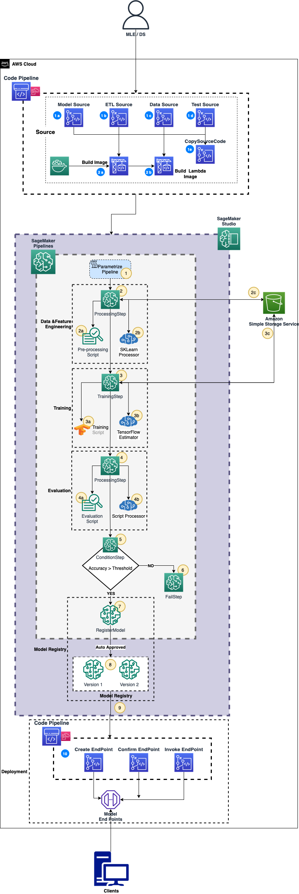

## MLOps Using SageMaker Pipelines

**[Amazon SageMaker Pipelines](https://aws.amazon.com/sagemaker/pipelines/)** , a new capability of Amazon SageMaker  that makes it easy for Data Scientists (DS) and ML Engineers (MLE) to build, automate, and scale end to end machine learning pipelines. SageMaker Pipelines is a native [workflow orchestration tool](https://docs.aws.amazon.com/sagemaker/latest/dg/workflows.html) for building ML pipelines that take advantage of direct Amazon SageMaker  integration. Three components improve the operational resilience and reproducibility of your ML workflows: pipelines, model registry, and projects. These workflow automation components enable you to easily scale your ability to build, train, test, and deploy hundreds of models in production, iterate faster, reduce errors due to manual orchestration, and build repeatable mechanisms.

This makes *Amazon SageMaker Pipelines* a great tool for orchestrating the MLOps workflow due to its native integrations and templates for SageMaker resources to use out of box.  A Pipeline is often used inside the context of a larger Dev/Ops workflow, and examples of that use case can be found in other sections of the lab.  For this section, we will focus on the basics of SageMaker Pipeline in order to build a strong foundation of knowledge before using Pipelines in the larger Dev/Ops ecosystem.

In this **Lab** you will implement an ML workflow using Amazon SageMaker Pipelines using SageMaker Studio for development of the ML Model. Once the ML Model is developed and unit tested in SageMaker, you will use the [AWS DevTools](https://aws.amazon.com/products/developer-tools/) to build the CI/CD by making use of the same Sagemaker Pipelines built during development.

Amazon SageMaker Pipelines is a purpose-built, easy-to-use continuous integration and continuous delivery (CI/CD) service for machine learning (ML). With SageMaker Pipelines, you can create, automate, and manage end-to-end ML workflows at scale. Since it is purpose-built for machine learning, SageMaker Pipelines helps you automate different steps of the ML workflow, including data loading, data transformation, training and tuning, and deployment. For the lab, we will focus on data loading, data transformation, training and evaluating a model and finally registering the model using SageMaker Pipelines. We will then use AWS DevTools to integrate the built Sagemaker Pipelines as continous deployment of end-points in QA and PROD.

So this Lab will use two types of pipelines to achive the complete workflow orchestration for our ML model :

- **Code Pipeline**

- **Sagemaker Pipeline**

`SageMaker Pipelines` are a series of interconnected steps (tasks) that is defined by a JSON pipeline definition.
In this Lab we will see how to use the SageMaker Studio notebook cells to define each of the SageMaker Steps and orchestrate the execution of the Sagemaker Pipeline. Once the JSON pipeline definiation is created as part of development/unit testing phase, we will make use of the Sagemaker pipeline JSON file to initiate the Code Pipeline workflow to deploy the end-points in Dev and then to QA/PROD as part of Countinous Integration and Deployment of the trained ML Model.

**Code Pipeline :**

Before we jump into SageMaker to create the Sagemaker pipeline for development of ML Model build, we will use the AWS CloudFormation tempates to create the AWS Code Pipeline workflow and the required resources needed to integrate with Sagemaker in-order to automate the model end point deployments into QA and Prod once the development of the Model build is completed and tested in Development.

**1.** Source code is checked into code repository (CodeCommit in this example). Data Engineers/Data Scientists will be checking code into the various branches or S3 (for Data Source)
-  **a.** *Model Source*: For model build, training and evaluation
-  **b.** *ETL Source*: For data and feature engineering
-  **c.** *Data Source (on S3)*: Input data used for training, testing and evaluating the model
-  **d.** *Test Source*: For validating the endpoint created

**2.** Once code/data is checked into CodeCommit Git Repo, we will trigger CodePipeline to begin an execution. (Post Development and unit testing)
-  **a.** *Build Image*: A training and inference container image is built using a tensorflow image from, DLC library of SageMaker, and uploaded to the ECR repository.
-  **b.** *Build Lambda Image*: A Lambda image is created with helper packages to be used to test the dev endpoint. The Lambda container will be used in `step 10` of `SageMaker Pipeline`.

**SageMaker Pipeline :**

Once the Code Pipeline has been set-up as pre-requsite, we will start with building the Sagemaker Pipeline needed for the ML workflow.

**1.** Define a set of Pipeline parameters that can be used to parametrize a SageMaker Pipeline.

*Parametrized Pipeline executions* - Enables variation in pipeline executions according to specified parameters, so you don't have to initiate the complete pipeline again if you need to re-run the pipeline with different set of parameters.

**2.** Define a **ProcessingStep** that performs cleaning, feature engineering, and splitting the input data into train and test data sets.
   * **a.** *A custom python script* to handle Data and Feature Engineering tasks so we have a well refined data ready for training the model

  * **b.** *SKLearn Processor* - a Processor framework that will spin up the required compute and other resources be used by the *ProcessingStep*

  * **c.** Store the processed data in Amazon S3 bucket that will be used during the Training of Model

**3.** Define a **TrainingStep** that trains a model on the preprocessed train data set for a TensorFlow Framework.

  * **a.**  *A Custom Training Script* to define the TensorFlow training model

  * **b.**  *TensorFlow Estimator* - A TensorFlow Regression Estimator that will spin up the required compute resources to be used in the TrainingStep

  * **c.**  Trained Model Artifact will be stored in the Amazon S3 Bucket

**4.** Define a **ProcessingStep** that evaluates the trained model’s performance (model accuracy using MSE) on the test dataset.

  * **a.** *A Custom Evaluation Script* to evaluate the model trained on the TensorFlow Framework

  * **b.** *ScriptProcessor* - A processor that spins up the required compute resources to run the TrainingStep

**5.** Define a **ConditionStep** that measures a Trained Model quality condition based on *Model Accuracy* output from prior steps and conditionally executes *RegisterModel* steps.

**6.** Define a **FailStep** with a customized error message indicating the cause of the execution failure. If the Model Accuracy is **Not** Met as per the MSE threshold defined in *ConditionStep*, then SageMaker Pipeline execution is Stoped with the custom defined failure message

**7.** Define a **RegisterModel** step that creates a model from the model artifacts used in training. A Register Model step creates a model package group from the estimator and model artifacts used to train the model.

**8.** The above *RegisterModel* step will create the models and **Auto** Approved (Can have a Manual Approval as second quality check gate) saved in SageMaker resources **Model Registry**

**9.** SageMaker **EndPoints** can be deployed using the Model Package Group from the SageMaker *Model Registry* using AWS Code Pipeline.

**10.** We will use the AWS Code Pipeline Code Deploy steps to `Create EndPoint`, `Confirm EndPoint` creation and `Invoke EndPoint` to test the successful creation of the End Point.

SageMaker Pipelines are a series of interconnected steps (tasks) that is defined by a JSON pipeline definition. The steps define the actions a pipeline takes. The order of execution of steps is determined by their data dependencies on one another. The data dependencies are created when the properties of a step’s output are passed as the input to another step. The SageMaker Pipelines service resolves the relationships between steps to create a data dependency DAG (directed acyclic graph).

## Security

See [CONTRIBUTING](CONTRIBUTING.md#security-issue-notifications) for more information.

## License

This library is licensed under the MIT-0 License. See the LICENSE file.

