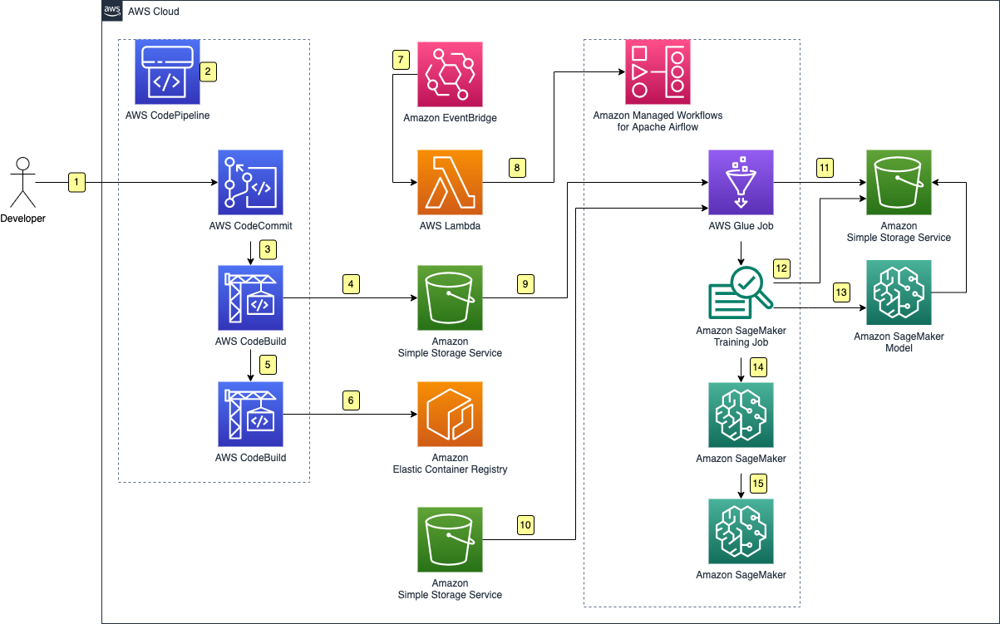

## MLOps using Amazon Managed Workflows for Apache Airflow

Apache Airflow is an open source platform to programmatically author, schedule, and monitor workflows. When you develop a new workflow with Airflow, you use Python code to
define a Directed Acyclic Graph (DAG) that represents the tasks and their interdependencies.  
  
Amazon Managed Workflows for Apache Airflow (MWAA) is a managed orchestration service for Apache Airflow that makes it easier to set up and operate end-to-end data 
pipelines in the cloud at scale. MWAA makes it easy to run and manage Airflow at scale by providing a fully managed Airflow environment. This helps you get up and
running quickly and reduces operational costs by eliminating the undifferentiated heavy lifting of building and scaling your own Airflow environment.

# MLOps with Amazon Managed Workflows for Apache Airflow

This architecture uses AWS SAM to deploy an Amazon Managed Workflows for Apache Airflow environment and CICD Pipeline that work together to perform end to end
cicd and model training for a maching learning model.

## Extending Airflow on AWS

Apache Airflow is built with a modular architecture that provides core functionality. It supports installation of additional packages called Providers. Providers give an 
interface to interact with outside services. You can find the list of Airflow providers in the [Airflow Documentation](https://airflow.apache.org/docs/#providers-packages-docs-apache-airflow-providers-index-html)
This workshop uses the built-in Python operators as well as operators from the Amazon Provider to interact with AWS services. 

## Services Used

 - **AWS CodePipeline** is a fully managed continuous delivery service that helps you automate your release pipelines for fast and reliable application and infrastructure updates. In this architecture it is being used to orchestrate the model image build and stage the etl assets when new source code is delivered to AWS CodeCommit.
 - **AWS CodeCommit** is a secure, highly scalable, managed source control service that hosts private Git repositories. In this architecture it is being used to store the model source code.
 - **AWS CodeBuild** is a fully managed continuous integration service that compiles source code, runs tests, and produces software packages that are ready to deploy. In this architecture it is the execution environment for the model image build and the etl staging job.
 - **Amazon EventBridge** is a serverless event bus that makes it easier to build event-driven applications at scale using events generated from your applications, integrated Software-as-a-Service (SaaS) applications, and AWS services. In this architecture it is being used to trigger the AWS Lambda function that executes the MWAA workflow.
 - **AWS Lambda**  is a serverless, event-driven compute service that lets you run code for virtually any type of application or backend service without provisioning or managing servers. In this architecture it is being used to execute the MWAA airflow dag.
 - **Amazon Simple Storage Service** (Amazon S3) is an object storage service offering industry-leading scalability, data availability, security, and performance. In this architecture it is being used as an object store for mlops assets, raw and preprocessed data, and the trained machine learning model.
 - **Amazon Elastic Container Registry** is a fully managed container registry offering high-performance hosting, so you can reliably deploy application images and artifacts anywhere. In this architecture it is being used to store built model images that are ready for training.
 - **Amazon Managed Workflows for Apache Airflow** (MWAA) is a managed orchestration service for Apache Airflow1 that makes it easier to set up and operate end-to-end data pipelines in the cloud at scale. In this architecture it is being used to orchestrate the data preprocessing, model training and model deployment.
 - **AWS Glue** is a serverless data integration service that makes it easy to discover, prepare, and combine data for analytics, machine learning, and application development. In this architecture AWS Glue is being used to execute preprocessing jobs to prepare data for machine learning.
 - **Amazon SageMaker** is a fully managed machine learning service. This architecutre leverage SageMaker features including:
   - SageMaker Training
   - SageMaker Model Registry
   - SageMaker Hosting

## Solution Description

1. A developer pushes a new version to **AWS CodeCommit**.
2. **AWS CodePipeline** starts a new pipeline.
3. **AWS CodePipeline** initiates the ETL staging task.
4. **AWS CodeBuild** copies the preprocessing job source code into Amazon Simple Storage Service.
5. **AWS CodePipeline** progresses to the Model Build task.
6. **AWS CodeBuild** executes the docker build and pushes the new image into AWS Elastic Container Registry.
7. **Amazon EventBridge** executes the NewBuildEventHandler whenever a new image is pushed to ECR or new raw data is uploaded to S3.
8. The **AWS Lambda** function triggers the MWAA Airflow dag.
9. **Amazon MWAA** triggers the AWS Glue Job and the Glue Job loads the raw preprocessing script from Amazon Simple Storage Service.
10. The preprocessing script running in **AWS Glue** loads the raw data from Amazon Simple Storage Service.
11. The **AWS Glue** Job writes the processed training, test, and validation splits to Amazon Simple Storage Service.
12. The **Amazon SageMaker** Training Job loads training data from Amazon Simple Storage Service.
13. The training job writes the trained model archive to **Amazom Simple Storage Service**.
14. The **Amazon MWAA** Airflow Dag uses the PythonOperator to create a new Model Package in Amazon Sagemaker.
15. The **Amazon MWAA** Airflow Dag uses the SageMakerEndpointOperator to deploy the new model to an Amazon SageMaker Endpoint.

## Security

See [CONTRIBUTING](CONTRIBUTING.md#security-issue-notifications) for more information.

## License

This library is licensed under the MIT-0 License. See the LICENSE file.

