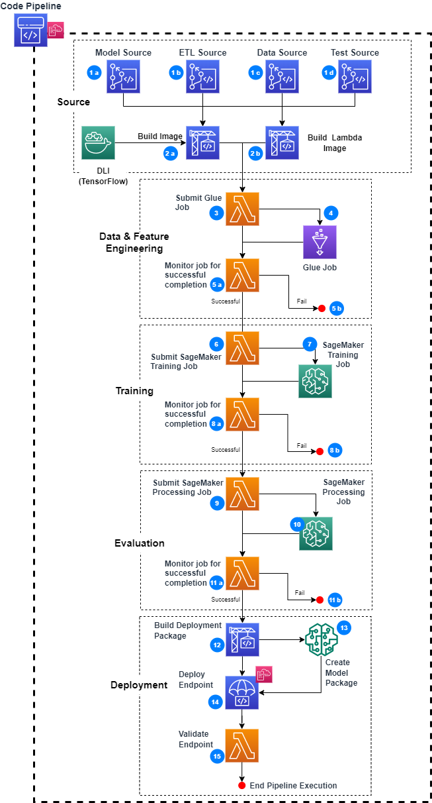

## MLOps Using AWS Developer Tools

This approach describes creating and orchestration of a MLOps pipeline using AWS Developer Tools. **[AWS Developer Tools](https://aws.amazon.com/products/developer-tools/)** are a set of services designed to enable developers and IT operations professionals practicing DevOps to rapidly and safely deliver software. 

In this example, AWS CodePipeline is used to orchestrate an end-to-end workflow using AWS Developer Tools, AWS Glue, AWS Lambda and SageMaker. The picture below describe the pipeline along with various stages in a MLOps Pipeline. 

**1.** Source code is checked into code repository (CodeCommit in this example). Data Engineers/Data Scientists will be checking code into the various branches or S3 (for Data Source)
-  **a.** *Model Source*: For model build, training and evaluation
-  **b.** *ETL Source*: For data and feature engineering
-  **c.** *Data Source (on S3)*: Input data used for training, testing and evaluating the model
-  **d.** *Test Source*: For validating the endpoint created

**2.** When code/data is checked into any of above branches, it triggers CodePipeline to begin an execution.
-  **a.** *Build Image*: A training and inference container image is built using a tensorflow image from, DLC library of SageMaker, and uploaded to the ECR repository.
-  **b.** *Build Lambda Image*: A Lambda image is created with helper packages to be used to test the dev endpoint. The Lambda container will be used in `step 15`.

**3.** After the **Build** has completed, the next stage is **Data and Feature Engineering**. A Lambda submits 
 - A `Glue Job` to perform Data/Feature engineering for the data loaded in `Data Source`
 - A `Lambda` that monitors the status of the `Glue Job`

**4.** The `Glue Job` executes and prepares data for model training, model testing and model evaluation

**5.** The `Lambda` that is monitoring the `Glue Job` waits until execution has completed
-  **a.** If execution is successful, then it transition to the next stage - *Training*
-  **b.** If execution fails, the pipeline execution stops

**6.** After the **Data and Feature Engineering** has completed, the next stage is **Training**. A Lambda submits 
 - A `SageMaker Training Job` to perform model training
 - A `Lambda` that monitors the status of the `SageMaker Training Job`

**7.** The `SageMaker Training Job` executes and generates a model

**8.** The `Lambda` that is monitoring the `SageMaker Training Job` waits until execution has completed
-  **a.** If execution is successful, then it transition to the next stage - *Evaluation*
-  **b.** If execution fails, the pipeline execution stops

**9.** After the **Training** has completed, the next stage is **Evaluation**. A Lambda submits 
 - A `SageMaker Processing Job` to perform model evaluation
 - A `Lambda` that monitors the status of the `SageMaker Processing Job`

**10.** The `SageMaker Processing Job` executes and evaluates the model

**11.** The `Lambda` that is monitoring the `SageMaker Processing Job` waits until execution has completed
-  **a.** If execution is successful and the model has an RMSE equal to or less than Quality Threshold, the model is `APPROVED`. It then it transitions to the next stage - *Deployment*
-  **b.** If nodel has RMSE greater than the Quality Threshold, then the model is `REJECTED`, and the pipeline execution stops

**12.** After the **Evaluation** has completed, the next stage is **Deployment**. A Configuration file is created to prepare model for deployment

**13.** The model is registered within `SageMaker Model Registry`

**14.** A CLoudFormation template creates infrastructure required for deploying the model to en edpoint. It uses `Configuration file` created in `Step 12` and `Registered Model` in `Step 13`

**15.** The Lambda Container created in `Step 2b` is used to test the endpoint for valid responses. This tests if the endpoint has been created and model successfully deployed. Test data created in `Step 3` is used for testing 

#### Required Services
In order to successful run this option, the following services will be used:

- **[AWS CloudFormation](https://aws.amazon.com/cloudformation/)**
- **[AWS CodePipeline](https://aws.amazon.com/codepipeline/)**
- **[AWS CodeCommit](https://aws.amazon.com/codecommit/)**
- **[AWS CodeBuild](https://aws.amazon.com/codebuild/)**
- **[Amazon ECR](https://aws.amazon.com/ecr/)**
- **[AWS Identity and Access Management (IAM)](https://aws.amazon.com/iam/)**
- **[AWS Lambda](https://aws.amazon.com/lambda/)**
- **[Amazon S3](https://aws.amazon.com/s3/)**
- **[AWS Glue](https://aws.amazon.com/glue/)**
- **[Amazon SageMaker](https://aws.amazon.com/sagemaker/)**

## Security

See [CONTRIBUTING](CONTRIBUTING.md#security-issue-notifications) for more information.

## License

This library is licensed under the MIT-0 License. See the LICENSE file.

